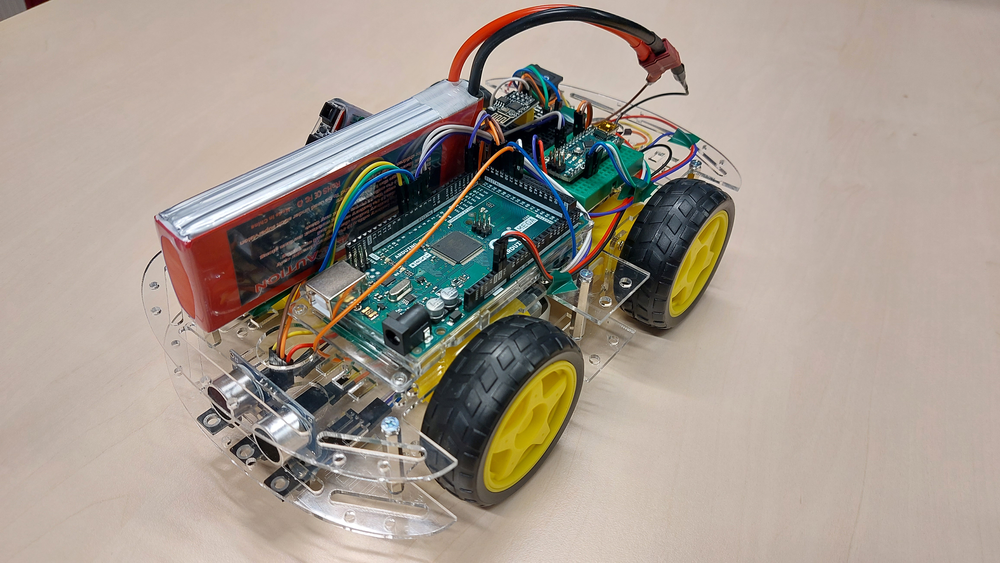
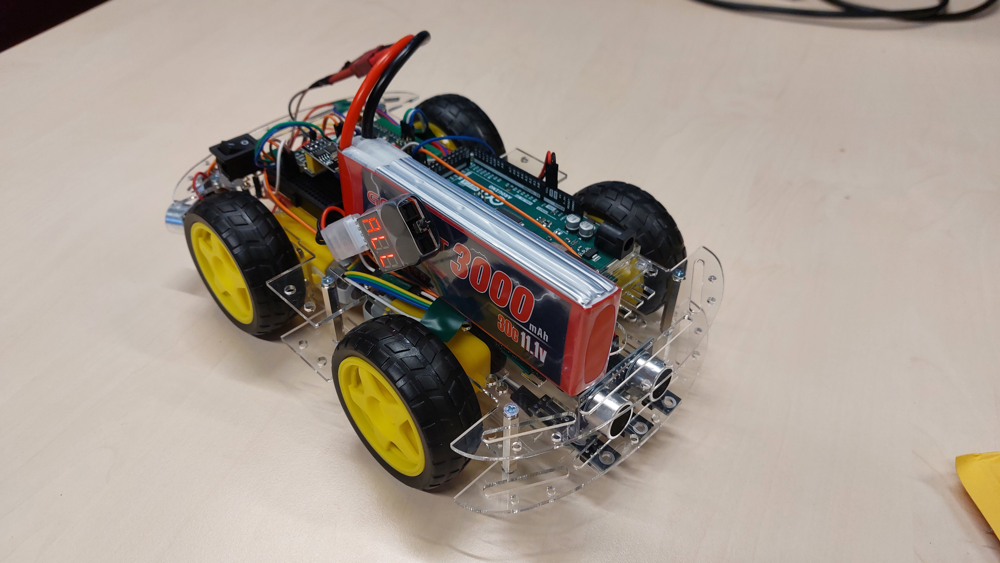
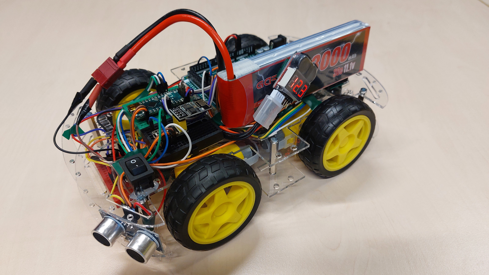

# The Arduino Car

This Arduino Car is used for the Master's thesis of David (@Code-Schwabe). It has the capabilities to
* drive autonomously following a line on the ground
* measure the distance in 2 directions (front and right rear)
* communicate with another Arduino Car using WiFi

## Hardware

The hardware in use is the following:
* 1 Arduino Mega 2560 Rev3
* 1 Arduino Nano Rev3
* 1 chassis with 4 simple DC motors
* 1 motor controller L298N
* 1 WiFi shield ESP8266-01S
* 3 infrared sensors KY-033
* 2 ultrasonic distance sensors HC-SR04 (tdb)
* ...many cables, glue and a breadboard

The hardware is wired as depicted here:

The two Arduinos communicate via an I2C bus connection.

It can be powered by any 12V power source - for mobility reasons, a 3 cell LiPo battery is used in our current set-up. It is also useful to connect the battery to a switch first, so the car isn't powered up directly on battery connection.

For some simple examples with the hardware device above, refer to the [Sensor Playground](https://github.com/SQA-Robo-Lab/Sensor-Playground). 

## Software

The software in this repository has two purposes:
* Demonstrate the capabilities of the Arduino Car.
* Provide device libararies (where possible) for the car's capabilities (continuous components) that can later be included in the code generation process.

### CarCoordinator

The CarCoordinator encapsulates the communication with other cars for coordinated behavior. Currently, it connects to an MQTT broker where it listens to "START" and "STOP" messages. Upon receiving a message, it instructs the LineFollower component to start or stop the car accordingly. 

### CarCoodrinatorLib [TODO]

The CarCoodrinatorLib serves to test the I2C and MQTT libraries that were created for the MUML-based code generation. Currently, the MQTT library is not working properly. 

### I2cLibTester

The I2cLibTester demonstrates the workings of the I2cCustomLib.

### I2cLineFollower

Extends the functionality of the LineFollowerLib with listening to messsages from I2C, demonstrating the workings of the I2cCustomLib.

### LineFollower

The LineFollower implement the interaction with the sensors (infrared, distance) and actuators (dc motors via motor controller) in order to make the car drive autonomously while following a black line on the ground and measure the distance to other cars or obstacles. The LineFollower module also listens to I2C messages that tell the car to "START" or to "STOP".

### LineFollowerLib

The LineFollowerLib contains the functionality of the LineFollower module and abstracts it into libraries that allow easier reuse. At the moment, the I2C functionality is not included.

## Installation Example

The following pictures show an exemplary set-up where the wiring is a little more visible (might be helpful for reconstruction).

And without the battery:

And the following pictures show an exemplary set-up where the wiring is a little more hidden (looks better :sparkles:).

