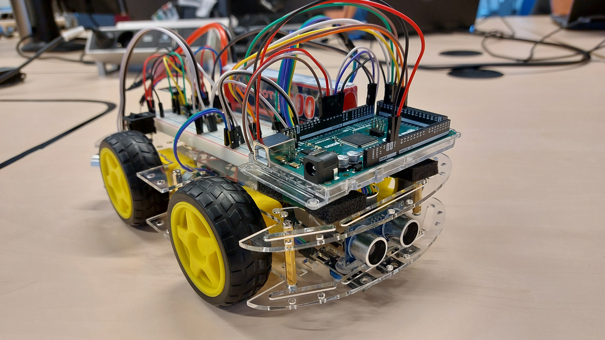
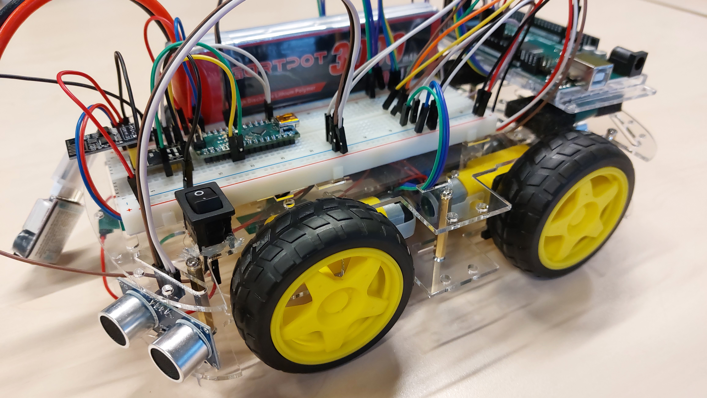
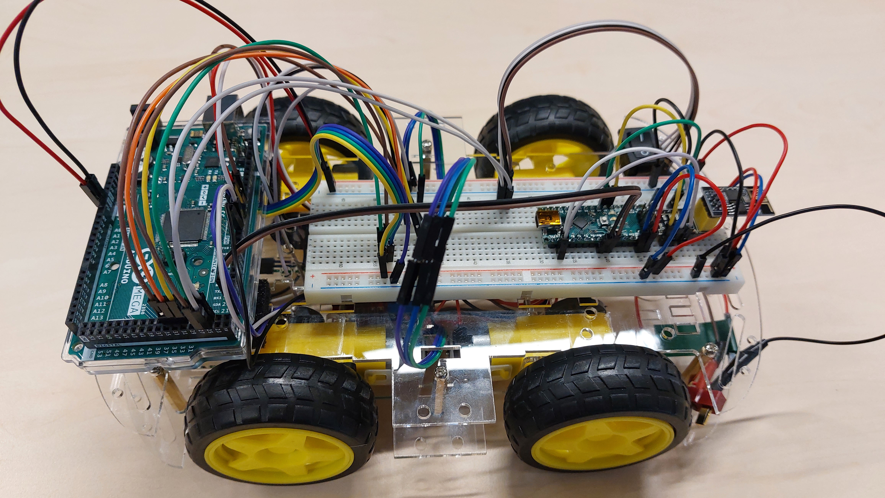

# The Arduino Car

This Arduino Car is used for the Master's thesis of David (@Code-Schwabe). It has the capabilities to
* drive autonomously following a line on the ground
* measure the distance in 2 directions (front and right rear)
* communicate with another Arduino Car using WiFi

## Hardware

The hardware in use is the following:
* 1 Arduino Mega 2560 Rev3
* 1 Arduino Nano Rev3
* 1 chassis with 4 simple DC motors
* 1 motor controller L298N
* 1 WiFi shield ESP8266-01S
* 3 infrared sensors KY-033
* 2 ultrasonic distance sensors HC-SR04 (tdb)
* ...many cables, glue and a breadboard

The hardware is wired as depicted here:

The two Arduinos communicate via an I2C bus connection.

It can be powered by any 12V power source - for mobility reasons, a 3 cell LiPo battery is used in our current set-up. It is also useful to connect the battery to a switch first, so the car isn't powered up directly on battery connection.

The following pictures show an exemplary set-up.

And without the battery:

## Software

The software in this repository has two purposes:
* Demonstrate the capabilities of the Arduino Car.
* Provide device libararies (where possible) for the car's capabilities (continuous components) that can later be included in the code generation process.

### LineFollower

The LineFollower libraries implement the interaction with the sensors (infrared, distance) and actuators (dc motors via motor controller) in order to make the car drive autonomously while following a black line on the ground and measure the distance to other cars or obstacles.

### CarCoordinator

The CarCoordinator encapsulates the communication with other cars for coordinated behavior. Currently, it only simulates the communication with the LineFollower and the connection to a WiFi network.